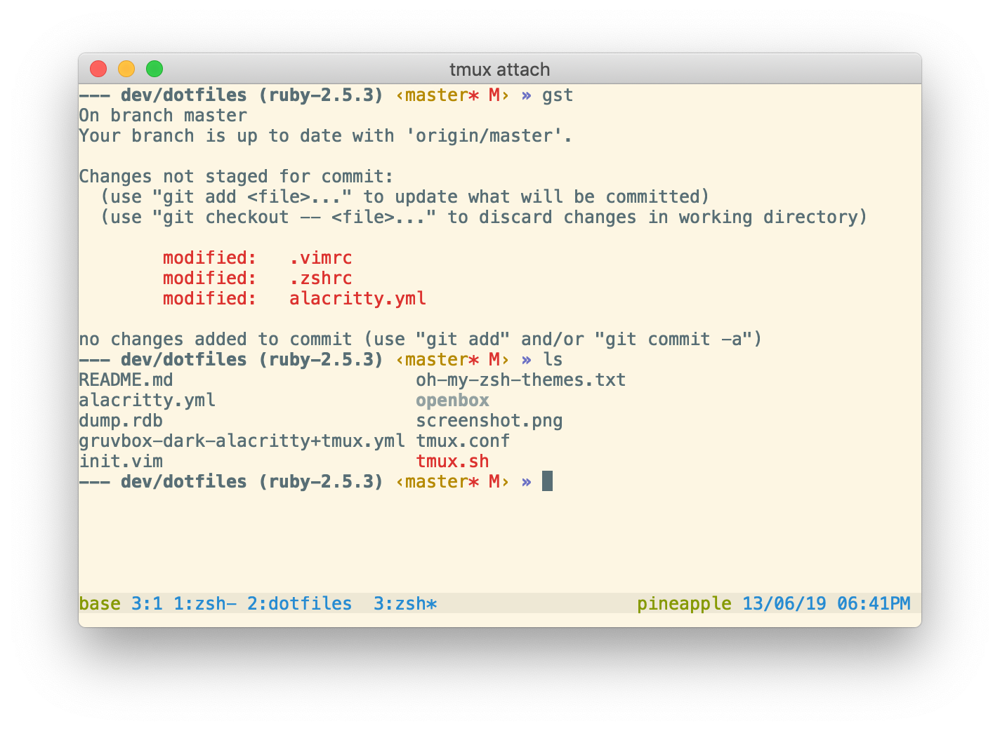

# sunrise-ruby
sunrise-ruby is just like the [sunrise](https://github.com/robbyrussell/oh-my-zsh/blob/master/themes/sunrise.zsh-theme) zsh theme but it has ruby version in your prompt.

Inspired by [superjarin](https://github.com/robbyrussell/oh-my-zsh/blob/master/themes/superjarin.zsh-theme) theme

## Usage
- `git clone https://github.com/ston1x/sunrise-ruby.git $ZSH_CUSTOM/themes/sunrise-ruby`
- `ln $ZSH_CUSTOM/themes/sunrise-ruby/sunrise-ruby.zsh-theme $ZSH_CUSTOM/themes/sunrise-ruby.zsh-theme`
- Add `ZSH_THEME="sunrise-ruby"` to your .zshrc

## This theme on [awesome-zsh-plugins]()
This theme [was added](https://github.com/unixorn/awesome-zsh-plugins/commit/09d3f3b573764fefaa41109955a0c71728859e27) to the awesome-zsh-plugins repo
